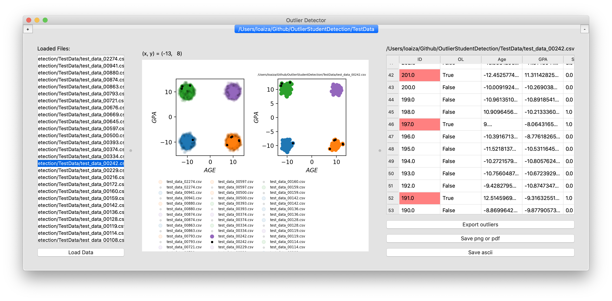

# OutlierStudentDetection

Simple **GUI** that interactively demonstrates a Proof of Concept (PoC) Machine Learning **ETL pipeline** for **outlier detection**



 - **Extract:** *reads data* from a database (several csv files in this case).
 - **Transform:** *converts the extracted data* by using a simple Machine Learning **outlier detector model**; *combines the data* with an extra feature column linking each record to its original source (the original csv file).
 - **Load:** *writes the data* into a target database (a single csv file in this case).

# Install:
```
 $ git clone https://github.com/juanmcloaiza/OutlierStudentDetection.git
 $ cd OutlierStudentDetection
 $ python3 -m venv ./localEnv
 $ source ./localEnv/bin/activate
 $ pip install --upgrade pip
 $ pip install -r requirements.txt  
```

# Run:
```
 $ python poc.py
```
